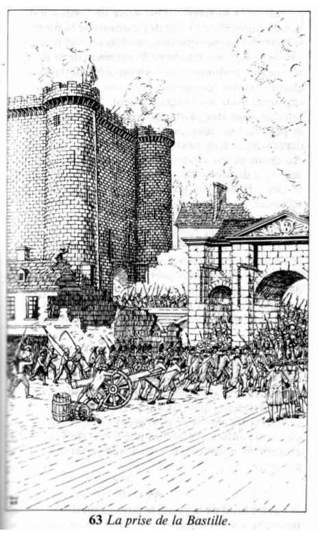

# Récapitulatif de votre aventure
| props | endurance | agilité | chance | force | diplomatie | adresse | habileté | équitation |
|---:|:---:|:---:|:---:|:---:|:---:|:---:|:---:|:---:|
|values |     5     |    9    |   9    |   9   |     11     |    9    |    7     |     11     |
## p1

	Vous vous trouvez à l'extrémité nord du Palais-Royal, à la tête de vos hommes. Vos instructions sont formelles : attendre qu'on vous en donne l'ordre pour ouvrir le feu sur les quelque dix mille manifestants qui ont envahi les jardins. Le régiment royal allemand et la Garde suisse, épaulés par la cavalerie du prince de Lambesc, bloquent les issues. La foule se met en branle dans votre direction en brandissant des bustes de Necker, le ministre récemment limogé qui avait la faveur du petit peuple. Vous remarquez la présence, parmi les manifestants, de quelques gardes nationaux, que vous pensiez être consignés dans leurs quartiers. Sur le côté, derrière la foule en marche, vous remarquez que les cavaliers commencent à éperonner leurs chevaux, et vous comprenez qu'ils ont dû recevoir l'ordre de charger. La populace se disperse. Beaucoup de manifestants s'enfuient de votre côté, et d'un geste bref votre Commandant vous fait signe d'ouvrir le feu.

Qu'allez-vous faire ?
- Tirer sur la foule
- enfreindre les ordres

-> enfreindre les ordres

## p60
	Sachant que vous ne pourrez jamais commander à vos hommes de tirer sur des femmes et des enfants désarmés, vous comprenez que vous vous trouvez devant une alternative : ou vous joindre aux émeutiers pour manifester contre l'intransigeance du roi, ou veiller à la sécurité de vos troupes.

Qu'allez-vous faire
- Décidez de faire reculer vos hommes
- Vous rallier au peuple

-> Décidez de faire reculer vos hommes

## p82
	Posément, vous tournez le dos à la foule et ordonnez à vos hommes d'épauler leurs armes et de dégager le passage. Avant qu'ils n'aient pu vous obéir, un officier arrive au grand galop, le visage convulsé de fureur, annule votre ordre et met pied à terre.

Qu'allez-vous faire ?
- Rester où vous êtes et l'affronter
- Déserter et vous joindre aux manifestants

-> Rester où vous êtes et l'affronter

## p16
	L'officier fait un pas en avant et vous gifle à toute volée. La joue cuisante du coup reçu, vous l'écoutez vociférer. — Vous êtes aveugle ou quoi ? Vous n'avez pas vu mon signal ? Commandez à vos hommes de tirer sur ces manants. A moins que vous ne soyez trop lâche pour ça ? Ces derniers mots vous font bouillonner de rage.

Qu'allez-vous faire ?
- exécuter cet ordre cinglant
- riposter à son geste

-> riposter à son geste

## p69
	Vous ripostez d'un coup de poing qui lui fait mordre la poussière. Brusquement calmé, vous prenez pleinement conscience des conséquences de votre acte, et vous comprenez que vous ne couperez pas à la cour martiale. A la cour martiale et au peloton d'exécution. Maintenant, vous n'avez plus le choix. Pivotant sur vos talons, vous courez vers la sécurité incertaine de la foule.

## p36
	Instinctivement, vous laissez tomber sur le gravier votre tricorne trop voyant. Votre tunique suit le même chemin, et vous vous mêlez plus étroitement à la foule. La cohue vous offre la meilleure protection que vous puissiez espérer. En quelques secondes, vous vous êtes suffisamment éloigné pour pouvoir souffler un peu, mais les soldats postés aux sorties des jardins constituent encore un danger.

## p41
	Bien que vous n'ayez plus ni tricorne ni tunique, certains manifestants reconnaissent en vous un militaire. Loin de s'en inquiéter, ils vous accueillent dans leurs rangs en vous tapant sur l'épaule et en vous criant : « Bravo ! » et « Soyez le bienvenu, soldat de la France ! » Le plus gros de la populace semble se diriger vers la partie des jardins occupée par la Garde suisse, et, en regardant par-dessus les têtes de ceux qui vous précèdent, vous voyez que les Suisses s'écartent pour laisser passer la foule. Vous prenez soin de rester au milieu de la cohue et n'osez pas tourner la tête vers les soldats de peur d'être reconnu. Comprenant votre situation, un homme à l'expression bienveillante, portant un tablier de boucher, vous adresse un clin d'œil et s'interpose entre les gardes et vous. Vous sortez des jardins côte à côte. Il vous propose de l'accompagner, et, n'ayant aucun autre endroit où aller, vous acceptez.

## p218
	Vous vous éloignez rapidement des jardins et tournez vers l'est dans une rue tranquille, où vous remarquez bientôt une petite rangée d'humbles échoppes. Votre guide emprunte un étroit passage pour atteindre la porte de derrière de sa boutique.
	— Entrez vite, dit-il. Le quartier ne va pas tarder à grouiller de soldats.
	Le logis du boucher est plongé dans la pénombre. Vous regardez autour de vous pendant qu'il ferme les volets et allume une bougie. Il se tourne ensuite vers vous.
	— Je m'appelle Bonneville, dit-il. Vous vous présentez à votre tour.
	— J'ai vu ce que vous avez fait au Palais-Royal, continue-t-il. Vous êtes un homme courageux, monsieur. Vous pouvez coucher ici ce soir si le cœur vous en dit, car, demain, nous nous mettons en quête d'armes pour nous défendre contre les soldats du roi.
	Cela vous paraît logique. Le peuple doit pouvoir se défendre contre les agressions comme celle qui s'est produite durant l'après-midi. Vous commencez à réfléchir à la question avec votre mentalité de militaire, et vous vous rappelez que l'hôtel des Invalides recèle un important dépôt de fusils, de poudre et de munitions. A cette nouvelle, le visage de Bonneville s'illumine.
	— Vous êtes doublement le bienvenu dans nos rangs, monsieur, déclare-t-il. Pour mettre sur pied une opération de cette envergure, il nous faudra au moins vingt-quatre heures. D'ici là, vous êtes mon hôte. Quand nous serons organisés, peut-être accepterez-vous de prendre la tête de notre groupe de citoyens. Nous avons désespérément besoin d'un homme de votre trempe.
	Autant regarder la vérité en face : en révélant à Bonneville un secret d'État, vous avez irrévocablement choisi votre clan. Vous acceptez son offre d'hospitalité et êtes d'accord pour vous montrer le moins possible jusqu'à ce que toutes les dispositions soient prises.

## p203
	Au cours de la journée du lendemain, Paris se met à ressembler davantage à une ville en état de siège qu'à la capitale de la France. Les citoyens élèvent des barricades, les boutiques d'armes sont mises à sac, et on ne voit nulle part le moindre signe d'opposition de la part de l'armée. Tout au long de la journée, le tocsin n'arrête pas de sonner, et le bruit court que des troupes étrangères auraient reçu l'ordre d'attaquer la ville. Les fausses alertes se multiplient, tandis que les citoyens se hâtent de protéger leurs rues contre un ennemi qui ne se manifeste pas. Vous ne vous éloignez guère de la boutique de Bonneville, craignant trop d'être reconnu pour oser vous aventurer plus loin. Le matin du deuxième jour, Bonneville vient vous réveiller. Il est accoutré d'une manière inhabituelle, avec deux pistolets croisés dans sa ceinture et un sabre qui lui bat la cuisse droite. Il vous tend un brassard tricolore et le bonnet phrygien qui est devenu l'emblème de la Révolution.
	— Mon ami, le moment est venu. Le peuple va maintenant passer à l'attaque. Marcherez-vous à notre tête ?
	Vous endossez vos vêtements, prenez vos armes et vous vous hâtez de descendre l'étroit escalier menant à la boutique. Plusieurs citoyens vous y attendent, tous armés comme Bonneville et l'air pareillement déterminé. Dehors, une foule nombreuse s'est rassemblée, mais peu de gens sont armés. Lorsque vous franchissez la porte, une clameur s'élève :
	— Vive la Révolution !
	En entendant ces mots, vous prenez brutalement conscience de l'énormité de ce que vous vous apprêtez à faire. Mais il est trop tard pour revenir en arrière. Vous vous mettez en marche vers 'hôtel des Invalides, la foule sur vos talons, les citoyens en armes à vos côtés. A chaque carrefour, de nouveaux émeutiers viennent grossir vos rangs. Lorsque vous arrivez en vue des grilles de l'armurerie, ils sont des centaines à se presser derrière vous. Vous faites signe à Bonneville d'arrêter et vous avancez seul vers les grilles.

## p30
	Vous vous approchez des grilles en prenant bien soin de laisser votre main à bonne distance de votre pistolet. Derrière les barreaux de fer forgé, la cour des Invalides est déserte. Les portes de l'armurerie se dressent à l'autre extrémité de l'espace découvert. Elles sont fermées. Vous poussez doucement les grilles, qui s'ouvrent toutes grandes devant vous.

Qu'allez-vous faire ?
- Essayer de parlementer avec les gardes postés derrière les portes
- Faire appel à la foule massée derrière vous pour envahir l'édifice

-> Essayer de parlementer avec les gardes postés derrière les portes

## p201
	Résolument, vous franchissez les grilles et, d'un pas ferme, vous traversez la cour en direction des portes. Vous savez que des yeux invisibles vous observent, et vous sentez vos cheveux se hérisser sur votre tête. D'une seconde à l'autre, vous allez sûrement entendre claquer un coup de fusil et sentir une balle vous labourer atrocement les chairs. Tout étonné d'être encore en vie, vous gravissez le perron de l'armurerie. De l'intérieur, une voix vous ordonne de vous arrêter.
	— Halte-là ! Qu'est-ce qui vous amène ?
	— Nous venons chercher les fusils, répondez-vous d'une voix claire et posée. Je sais que vous n'êtes qu'une poignée. Nous sommes des centaines. Nous autoriserez-vous à prendre possession des armes sans effusion de sang ? Je peux vous garantir qu'il ne vous sera fait aucun mal si vous vous inclinez devant la volonté du peuple. Si vous refusez...
	Vous ne terminez pas votre phrase, laissant aux hommes enfermés dans l'armurerie le soin de deviner quel sort leur sera réservé s'ils refusent. Vous entendez des voix assourdies discuter derrière la porte. Apparemment, elles ne sont pas d'accord, et vous décidez d'insister un peu.
	— Hâtez-vous de prendre votre décision, dites-vous. Les citoyens de Paris s'impatientent.
	Il se peut que vous ayez été trop loin.

Vous réussissez le teste de la qualité : diplomatie !

## p74
	Les gardes déverrouillent le portail. Vous vous retournez vers Bonneville et lui faites signe de vous rejoindre. Il s'avance avec quelques dizaines d'hommes, et le gros de la foule le suit de près. Après avoir ordonné aux sentinelles de déposer leurs armes, vous les placez sous la sauvegarde de Bonneville. Avec un sourire mauvais, celui-ci les conduits dans une pièce voisine, et plusieurs citoyens armés y entrent à leur suite. Quelques secondes s'écoulent, puis, à votre profonde horreur, Bonneville réapparaît en essuyant un coutelas ruisselant de sang sur une coiffure de garde. En ricanant, il ordonne à ses hommes de forcer les cadenas des râteliers et de distribuer les fusils. Un grand cri s'élève de la foule : « A la Bastille ! »

Allez-vous accompagner la populace ?
- Oui
- préférez-vous profiter de la confusion pour vous esquiver

-> Oui

## p254
	La populace déferle dans les rues, grossie à chaque carrefour par de nouveaux manifestants auxquels des charretiers distribuent des fusils et de la poudre. L'allure s'accélère, et vous êtes entraîné par la cohue. De petits groupes de soldats sont balayés par la poussée irrésistible de la foule. En arrivant devant le Palais de Justice, vous remarquez une compagnie de cavalerie rangée dans une rue latérale, mais elle ne paraît pas disposée à s'interposer. Bonneville donne l'ordre à quelques hommes armés de jalonner l'itinéraire de la foule, pour le cas où celle-ci serait attaquée. En passant la Seine, vous apercevez, sur votre gauche, la flèche de Notre-Dame. La Bastille n'est plus très loin. Les premières rangées d'émeutiers ont dû atteindre la prison, car vous entendez, tout près, une pétarade de coups de fusil.

Allez-vous continuer à suivre la foule ou, découragé, profiter de la confusion pour vous éclipser ?
- continuer à suivre la foule
- profiter de la confusion pour vous éclipser

-> continuer à suivre la foule

## p63

	En arrivant place de la Bastille, vous pressez le pas pour rattraper Bonneville. Vous le rejoignez au moment où il lance une attaque de front contre le portail de la forteresse. Une salve de fusils jaillit de l'étage supérieur de l'une des maisons de la place, où se sont embusqués quelques soldats arrivés trop tard sur les lieux pour renforcer la garnison de la prison. Bonneville ordonne à des volontaires de lancer un chariot contre les portes. Une fois. Deux fois. Au troisième essai, les vantaux cèdent. Vous vous précipitez, et vous êtes parmi les premiers à pénétrer dans la prison. Les deux ou trois sentinelles qui étaient demeurées à leur poste sont massacrées sans pitié. Au moment où vous ouvrez les portes intérieures, une balle de fusil siffle à votre oreille. Vous faites volte-face : Bonneville gît sur le sol, inerte. Quelques secondes plus tard, son cadavre est piétiné par la ruée de la populace. Devant vous, une silhouette familière recharge rapidement son arme. C'est Sourdeval, un sergent de votre ancien régiment. Apparemment, il ne vous reconnaît pas.

Qu'allez-vous faire
- l'attaquer
- profiter de la confusion pour vous esquiver

-> l'attaquer

## p295
	Vous dégainez votre épée et bondissez, sans laisser au sergent Sourdeval le temps de recharger son arme. Poussant un juron, celui-ci recule, lâche son fusil et tire sa propre lame. Le sergent Sourdeval est un vieux briscard aguerri et il est plus que compétent avec une épée, mais vous avez le temps de lui porter le premier Assaut.

---

Combattants :

Ennemis : |sergent Sourdeval |
|--:|:--:|
| |⚔️  : 8 ❤️  : 4 |

VS

Mon Equipe : | VOUS |
|--:|:--:|
| |⚔️  : 7 ❤️  : 3 |

---
Les tours :

| Tour | 0 | 1 | 2 |
|--:|:--:|:--:|:--:|
| VOUS | -1 | -1 | -1 |
| sergent Sourdeval | -1 | 0 | -1 |

## p71
	Adroitement, il vous décoche un coup de couperet que vous ne parvenez pas à esquiver. La lame vous atteint au cou et vous sectionne la veine jugulaire. C'est ici que se termine votre aventure.
