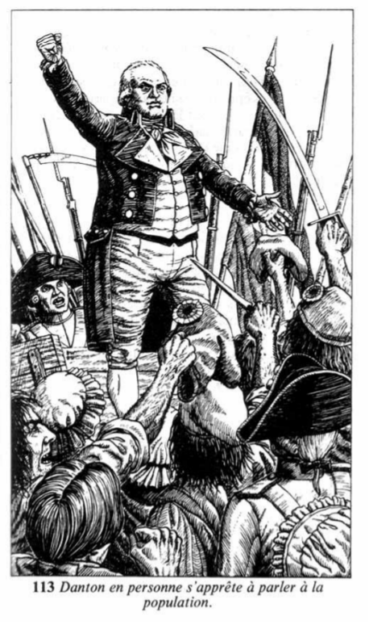
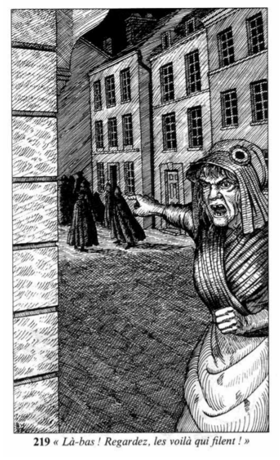
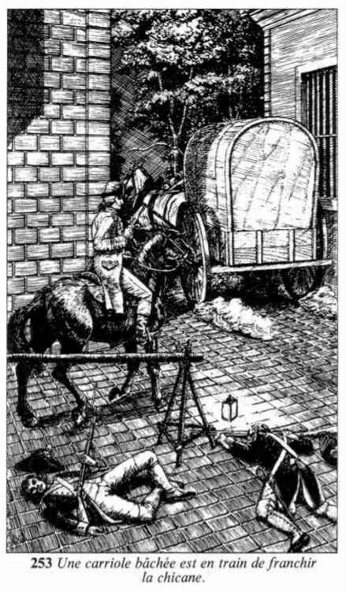

# Récapitulatif de votre aventure
| props | endurance | agilité | chance | force | diplomatie | adresse | habileté | équitation |
|---:|:---:|:---:|:---:|:---:|:---:|:---:|:---:|:---:|
|values |     4     |    7    |   7    |   7   |     8      |    7    |    8     |     11     |
## p206
Les derniers cavaliers s'enfuient en débandade, et les cellules accueillent de nouveaux prisonniers, appartenant cette fois à l'armée du roi. Vous rassemblez leurs montures, et c'est à cheval que vous entrez triomphalement dans Paris. Si vous avez été blessé, vos plaies auront le temps de cicatriser. Ramenez donc votre total d'Endurance à son niveau initial.

Vous retrouvez 4 sur votre qualité : endurance 🏃

## p113

Le lendemain, vous êtes tiré d'un profond sommeil par les exclamations d'une foule en délire. Vous vous précipitez à la fenêtre et voyez que Danton en personne s'apprête à parler à la population. Danton ! Le membre du Conseil exécutif qui a réclamé la tête de Louis XVI ! L'idole du peuple ! Le meneur d'hommes par excellence ! Vous dévalez l'escalier et vous vous précipitez dehors pour vous mêler à la foule qui s'est amassée pour entendre le tribun. La harangue de Danton est d'une éloquence si convaincante que vous éprouvez le besoin impérieux de vous joindre à lui pour écraser les ennemis de la République. A votre grande surprise, vous faites partie de ceux qu'il sélectionne parmi la masse des volontaires pour former la nouvelle Garde nationale qu'il vient de créer.
Plusieurs semaines passent, durant lesquelles vous vous élevez rapidement au grade de sergent de la Garde nationale. Les horaires sont durs, mais le travail est intéressant : rétablir l'ordre dans la ville pour que les citoyens ordinaires s'y sentent en sûreté et traquer les derniers groupes d'aristos honnis qui se cachent encore dans Paris pour échapper à la vindicte populaire. Un soir, alors que vous patrouillez dans votre secteur, une petite vieille toute ratatinée vous accoste en vous tirant par la manche.
— Citoyen soldat, dit-elle d'une voix chevrotante, je désire signaler la présence de nombreux aristos dans la maison voisine de la mienne.
— Pas possible ? rétorquez-vous, assez incrédule.
— Parfaitement, insiste-t-elle, c'est la vérité. Ça va bientôt faire une semaine qu'ils sont là, mais je n'étais pas certaine que c'était des aristos avant ce soir, quand je les ai entendus discuter en passant sous leur fenêtre. Ils faisaient des plans pour s'enfuir de Paris.
Cette histoire vous paraît trop circonstanciée pour être inventée, mais vous avez encore des doutes.

## p174

## p39
En arrivant à l'adresse indiquée, vous constatez qu'il s'agit d'une petite maison toute semblable à ses voisines, dans une rue tranquille. Il n'y a pas de lumière aux fenêtres, et on n'entend aucun bruit.

## p229
Vous vous approchez de la porte d'entrée et frappez. Après une courte attente, une jeune femme en chemise de nuit, portant une lanterne, vient vous ouvrir.
— Excusez-moi de vous déranger, citoyenne, dites-vous, mais on m'a signalé que cette maison abritait plusieurs aristos. Pendant un instant, elle paraît décontenancée, puis elle éclate de rire.
— Je parie que vous tenez cela de la vieille femme d'à côté, dit-elle. Il faut que vous soyez nouveau dans le quartier pour ne pas la connaître. Elle a dénoncé l'une après l'autre toutes les maisons de la rue. Elle voit des aristos cachés sous tous les lits ! Je sais bien que ça part d'une bonne intention, mais trop, c'est trop ! Désolée que vous vous soyez dérangé pour rien, sergent.

## p88
— C'est bien possible, citoyenne, ripostez-vous, mais c'est mon devoir de fouiller cette maison, même si mes soupçons ne reposent sur rien. Laissez-moi -passer, je vous prie. Après avoir hésité une seconde, elle ouvre la porte toute grande et s'écarte. La maison est petite, et la fouiller ne vous prend pas longtemps. Dans l'une des chambres à l'étage, vous trouvez sous un lit un petit pistolet à la crosse incrustée d'argent : incontestablement une arme d'aristo. En vous relevant, vous remarquez également plusieurs tasses à thé, posées sur un buffet. Elles sont encore tièdes. Quels qu'ils soient, ceux qui ont bu dans ces tasses ne peuvent pas être loin. Vous redescendez les marches quatre à quatre

## p219

Vous vous éloignez de la maison et, en traversant la rue, vous voyez accourir la petite vieille qui vous avait renseigné. Sans vous laisser le temps de dire un mot, elle tend le doigt vers l'extrémité de la rue et glapit de sa voix aigre :
— Là-bas ! Regardez, les voilà qui filent !
Vous tournez les yeux dans la direction indiquée et constatez qu'elle dit vrai. Un groupe de silhouettes encapuchonnées est entrain de tourner le coin de la rue d'un bon pas. Vous vous lancez immédiatement à sa poursuite.
Soudain, la rue bifurque. Si vous êtes accompagné, vous pouvez diviser vos forces. Sinon, vous devez continuer la poursuite tout seul.

## p58

## p237
Vous prenez la rue de droite. En arrivant à un nouveau coude, vous découvrez les silhouettes encapuchonnées, arrêtées à une centaine de mètres devant vous.

## p293
La balle atteint l'une des silhouettes encapuchonnées, qui s'écroule. Les autres font demi-tour et détalent, chacune dans une direction différente. Même si des soldats vous accompagnent, vous n'avez guère de chances de les rattraper.

## p205
Vous vous approchez du fugitif abattu et constatez qu'il s'agit d'un jeune homme de vingt et quelques années. En fouillant le corps, vous découvrez, dans une poche, un assortiment de faux papiers d'identité, ainsi qu'une feuille pliée en quatre. Vous dépliez celle-ci et, à la lumière provenant d'une fenêtre, vous lisez ce qui suit :
Le garde s'appelle Valmy. Il vous laissera passer si vous lui remettez cinq louis d'or.
Vous comprenez avec horreur ce que cela signifie : l'un des gardes préposés à la surveillance des portes de la ville a été soudoyé. Si vous n'agissez pas promptement, les aristos ont encore une chance de réussir leur évasion.
Vous avez une décision délicate à prendre.

## p25
Ayant pris la décision d'inspecter vous-même toutes les portes de l'enceinte, vous vous mettez immédiatement à l'œuvre. La première porte à laquelle vous vous rendez est bien gardée, et personne n'y a entendu parler d'un soldat nommé Valmy. Vous poursuivez votre chemin jusqu'à la suivante... et encore la suivante... et encore la suivante. A la quatrième porte, l'un des hommes que vous interrogez reconnaît le nom. — Oui, répond-il, Valmy est de garde cette nuit, à la porte de la rue des Clefs. Pourquoi ? Vous vous expliquez rapidement, et plusieurs soldats se joignent à vous lorsque vous vous dirigez en hâte vers la rue indiquée. Vous avez à peine couvert la moitié de la distance que le bruit d'une fusillade retentit au loin. Espérant, contre toute probabilité, ne pas arriver trop tard, vous vous élancez.

## p253
En arrivant en vue de la porte, vous embrassez la situation d'un coup d'œil. Autour de la barricade ouverte gisent plusieurs soldats, tous morts. Une carriole bâchée, dont on ne voit que le cocher, est en train de franchir la chicane. Elle est suivie par un cavalier armé d'un pistolet.

## p98
Mettant un genou à terre, vous calez votre pistolet sur votre avant-bras, visez soigneusement le cocher et tirez. Pour savoir si vous parviendrez à l'atteindre, testez votre Adresse. Mais il vous faut diminuer votre talent de 1 point parce que votre course jusqu'à la porte vous a mis hors d'haleine.

Vous perdez 1 sur votre qualité : adresse 🤸
| Tour | 0 | 1 |
|--:|:--:|:--:|
| VOUS | -2 | -2 |
| Premier HUSSARD | -1 | -1 |
| Second HUSSARD | 0 | 0 |

## p17
Le sabre du cavalier vous fauche. Pendant que vous vous écroulez, l'homme vous assène un dernier coup de lame pour s'assurer que vous êtes bien mort. C'est ici que se termine votre aventure.
