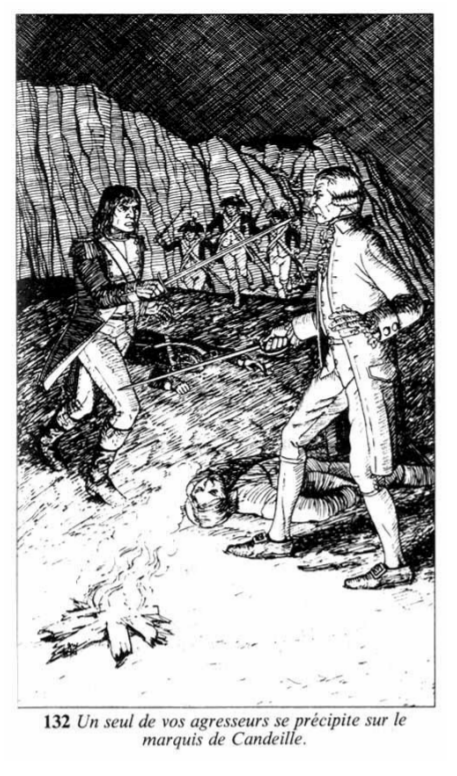

# Récapitulatif de votre aventure
| props | endurance | agilité | chance | force | diplomatie | adresse | habileté | équitation |
|---:|:---:|:---:|:---:|:---:|:---:|:---:|:---:|:---:|
|values |     4     |    7    |   8    |   8   |     7      |    7    |    11    |     8      |
## p132

	Haletant, vous faites arrêter vos compagnons. Vous vous retournez et dégainez votre pistolet. A vos côtés, les autres en font autant. Vos cibles sont difficiles à distinguer à la lueur vacillante des flammes, mais vous tirez quand même. Lorsque vos trois armes sont déchargées, vous constatez que l'un des révolutionnaires a été tué, mais, près de vous, le comte de La Vallière gît également sur le sable, perdant son sang. Vous n'avez pas le temps de vous apitoyer sur son sort, car vos agresseurs sont pratiquement sur vous. Vous tirez votre épée et courez à leur rencontre. Ils sont trois, et un seul d'entre eux se dirige vers le vieux marquis de Candeille, qui tient son arme d'une main un peu tremblotante, mais résolue. Quatre Assauts au moins se succéderont avant que des secours ne puissent vous parvenir au canot. Il vous faut donc retenir vos agresseurs jusque-là ou mourir.

---

Combattants :

Ennemis : |premier agresseur | deuxième agresseur | troisième agresseur |
|--:|:--:|:--:|:--:|
| |⚔️  : 6 ❤️  : 3 | ⚔️  : 4 ❤️  : 2 | ⚔️  : 9 ❤️  : 4 |

VS

Mon Equipe : | VOUS |marquis |
|--:|:--:|:--:|
| |⚔️  : 11 ❤️  : 3 | ⚔️  : 4 ❤️  : 2 |

---
Les tours :

| Tour | 0 | 1 | 2 |
|--:|:--:|:--:|:--:|
| VOUS | -1 | 0 | -2 |
| premier agresseur | 0 | 0 | 0 |
| deuxième agresseur | -1 | -1 | ☠️ |
| marquis | -1 | -1 | ☠️ |
| troisième agresseur | 0 | 0 | -1 |

## p4
	Vous vous êtes bien battu, mais vous aviez affaire à trop forte partie. Votre sang se répand sur la plage de la petite crique, et vous rendez le dernier soupir. C'est là que votre aventure se termine, si près et néanmoins si loin du refuge.
